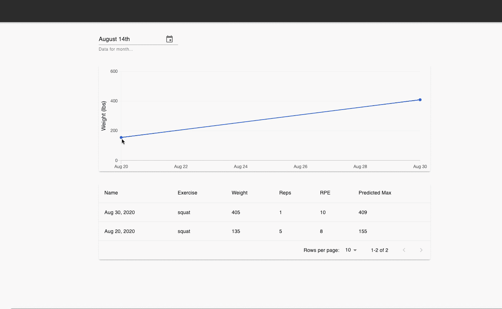

## About this project...

This project was created to practice creating a React SPA with ReactJS, MaterialUI and possibly more! This project is an alternative layout to what was done using an existing template, as seen [here](https://github.com/samly97/architectui-react-theme-free).

This frontend component would be used in conjunction with a Golang API server, the latter of which is a private repo.

## Demos

### Update September 14th, 2020

I finished a prototype of an exercise page. In this page the user could see their workout data for a particular month. By default, it displays data for the current month.

The user could see their predicted max, which calculated based on their reps and the weight lifted. This is a useful metric to see if they are progressing in terms of strength/hypertrophy.

Demo is as follows:

TODO:

- ~~Add tabs to show other workout metrics such as weekly volume, PRs, etc.~~ (September 15, 2020)
- ~~Create page for Bench, Squat, and Deadlift~~ (September 18, 2020)
- ~~Create a sidebar nav to navigate between pages~~ (September 18, 2020)
- ~~Use React router to route those pages~~ (September 18, 2020)
- Rethink content displayed in workout table. I think it will be more beneficial to show metrics at first site rather than dumping sets into the table. For instance:
  - Show top set @ x reps
  - Show volume for that session
  - Add link to open modal to show sets
- Add general "Workout" and "PR" page so users could:
  - Add new workouts/PRs
  - See all their workouts/PRs (squat/bench/dead)
- Add widget page for dashboard view
- Add Home button to navigate to landing page
- Logouts
- Modify user settings

### Usage:

## Development Backend Server:

To run the front end
cd into the client folder
npm start

## Development Backend Server:

To run the app in development mode:
nodemon server.js from this directory
